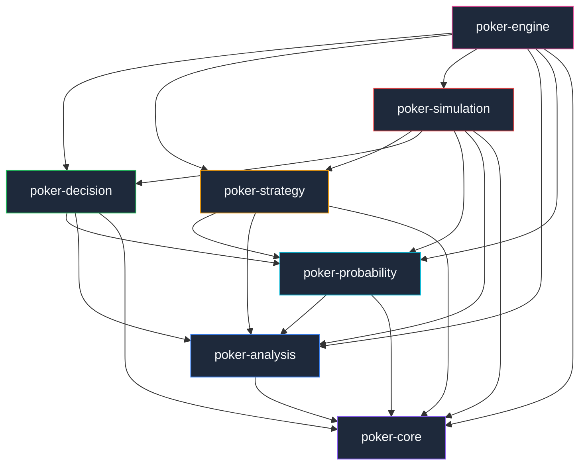

<div align="center">

# ♠️ JEROME

**Judgement Engine for Range, Odds, Moves & Equity**

**A high-performance, deterministic No-Limit Texas Hold'em decision engine built in Rust.**

Makes optimal poker decisions using pure mathematics — probability, combinatorics,
Bayesian range modeling, EV analysis, and GTO heuristics. No AI. No neural networks. Just math.

[](https://www.rust-lang.org/)
[](LICENSE)
[](.github/workflows/ci.yml)
[]()

[Architecture](#architecture) •
[Quick Start](#quick-start) •
[Poker Concepts](#poker-concepts-primer) •
[Benchmarks](#performance--benchmarks) •
[Contributing](CONTRIBUTING.md)

</div>

---

## How It Works

The engine accepts a complete game state and returns a ranked set of recommended actions, each annotated with expected value and human-readable explanations.


The core is **transport-agnostic** — it accepts strongly-typed Rust structures and returns strongly-typed results. No HTTP, no WebSocket, no JSON serialization. Adapters for external systems (FFI, WebAssembly, Python bindings, gRPC) can wrap the core without modifying it.

```text
External System → Adapter → Typed GameState → Pure Poker Mathematics → DecisionResult → Adapter → External System
```

---

## Why This Project?

Most poker "engines" fall into two camps:

1. **Black-box ML models** — opaque, non-deterministic, impossible to audit or explain
2. **Toy rule engines** — `if hand == "AA" then raise` — fragile and strategically naive

This engine takes a different approach: **encode decades of poker theory as composable, deterministic mathematical pipelines.** Every decision can be traced back to concrete numbers — equity percentages, pot odds ratios, expected value calculations, and strategic heuristics.

### Non-Goals

- ❌ AI/ML inference or neural network evaluation
- ❌ Real-money gambling integration or online poker bots
- ❌ Transport layer (HTTP, WebSocket, gRPC) — that's the adapter's job
- ❌ GUI or visual interface — this is a computational core

---

## Architecture

### Crate Dependency Graph



### Workspace Crates

| Crate | Responsibility | Key Modules |
|:------|:---------------|:------------|
| **`poker-core`** | Foundation primitives — cards, deck, game state, betting actions, rules, error types | `card`, `game`, `betting`, `rules`, `error` |
| **`poker-analysis`** | Hand evaluation, board texture analysis, range modeling, blocker analysis, Bayesian opponent modeling | `hand`, `board`, `range`, `blockers`, `opponent` |
| **`poker-probability`** | Equity calculation (exact enumeration + Monte Carlo), pot odds, outs counting, implied odds | `equity`, `odds` |
| **`poker-decision`** | Action candidate generation, EV calculation, decision pipeline orchestration, human-readable explanations | `actions`, `ev`, `decision`, `explanation`, `config` |
| **`poker-strategy`** | Strategy layer — value betting, bluff frequency, exploitative adjustments, GTO approximations | `value`, `bluff`, `exploitative`, `gto`, `strategy` |
| **`poker-simulation`** | Scenario simulation and batch benchmarking harness | `scenario`, `simulator`, `benchmark` |
| **`poker-engine`** | Unified facade re-exporting all crates: `PokerEngine::analyze(&GameState) → DecisionResult` | top-level API |

---

## Quick Start

### Prerequisites

- [Rust](https://rustup.rs/) (2021 edition, stable toolchain)

### Build & Test

```bash
# Clone and build
git clone https://github.com/your-username/poker-engine.git
cd poker-engine

cargo build --workspace
cargo test --workspace
```

### Add to Your Project

```toml
[dependencies]
poker-engine = { path = "path/to/poker-engine/crates/poker-engine" }
```

### Usage Example

```rust
use poker_engine::{PokerEngine, EngineConfig};
use poker_engine::core::card::{Card, Rank, Suit};
use poker_engine::core::game::{GameStateBuilder, Player, PlayerStatus, Street};
use poker_engine::core::Position;

fn main() -> Result<(), Box<dyn std::error::Error>> {
    // 1. Create the engine with default configuration
    let engine = PokerEngine::new(EngineConfig::default());

    // 2. Build a game state
    let state = GameStateBuilder::new()
        .street(Street::Flop)
        .hero_cards([
            Card::new(Rank::Ace, Suit::Spades),
            Card::new(Rank::King, Suit::Spades),
        ])
        .board(vec![
            Card::new(Rank::Queen, Suit::Spades),
            Card::new(Rank::Ten, Suit::Hearts),
            Card::new(Rank::Five, Suit::Diamonds),
        ])
        .pot(120)
        .current_bet(40)
        .big_blind(2)
        .add_player(Player {
            id: 0,
            position: Position::BTN,
            stack: 980,
            status: PlayerStatus::Active,
            bet_this_round: 0,
        })
        .add_player(Player {
            id: 1,
            position: Position::BB,
            stack: 960,
            status: PlayerStatus::Active,
            bet_this_round: 40,
        })
        .hero_index(0)
        .build()?;

    // 3. Run decision analysis
    let result = engine.analyze(&state)?;

    // 4. Inspect the result
    println!("Recommended: {:?}", result.recommended_action);
    println!("Equity:      {:.1}%", result.estimated_equity * 100.0);
    println!("EV:          {:.2}", result.estimated_ev);
    println!("Explanation: {}", result.explanation);

    // 5. Review all evaluated alternatives (sorted by EV)
    for alt in &result.alternatives {
        println!("  {:?} → EV: {:.2}", alt.action, alt.ev);
    }

    Ok(())
}
```

---

<details>
<summary><b>♠️ Poker Concepts Primer</b> — click to expand if you're new to poker theory</summary>

### Core Concepts

Understanding the engine's output requires familiarity with a few key poker mathematics concepts:

#### Hand Rankings (Strongest → Weakest)

| Rank | Hand | Example |
|:-----|:-----|:--------|
| 1 | Royal Flush | A♠ K♠ Q♠ J♠ T♠ |
| 2 | Straight Flush | 9♥ 8♥ 7♥ 6♥ 5♥ |
| 3 | Four of a Kind | K♠ K♥ K♦ K♣ 4♠ |
| 4 | Full House | A♠ A♥ A♦ 8♣ 8♠ |
| 5 | Flush | A♦ J♦ 8♦ 6♦ 3♦ |
| 6 | Straight | T♠ 9♣ 8♥ 7♦ 6♠ |
| 7 | Three of a Kind | Q♠ Q♥ Q♦ 9♣ 4♠ |
| 8 | Two Pair | J♠ J♥ 5♦ 5♣ A♠ |
| 9 | One Pair | A♠ A♥ K♦ 9♣ 4♠ |
| 10 | High Card | A♠ Q♥ 9♦ 6♣ 3♠ |

#### Streets (Betting Rounds)

| Street | Community Cards | Description |
|:-------|:---------------|:------------|
| **Preflop** | 0 | Players receive 2 hole cards; first betting round |
| **Flop** | 3 | Three community cards dealt simultaneously |
| **Turn** | 4 | Fourth community card added |
| **River** | 5 | Fifth and final community card |

#### Key Mathematical Concepts

- **Equity** — The probability (0–100%) that your hand will win at showdown against an opponent's range. Calculated via Monte Carlo simulation or exact enumeration.

- **Pot Odds** — The ratio of the current pot to the cost of a call. If the pot is 100 and you must call 25, your pot odds are 4:1 (you need ≥20% equity to call profitably).

- **Expected Value (EV)** — The average profit/loss of an action over infinite repetitions. Positive EV (+EV) actions are profitable long-term.

  $$EV_{\text{call}} = (\text{Equity} \times \text{Pot}) - ((1 - \text{Equity}) \times \text{Cost to Call})$$

- **Implied Odds** — Extension of pot odds that accounts for additional money you expect to win on later streets if you hit your draw.

- **Stack-to-Pot Ratio (SPR)** — `Effective Stack / Pot`. Low SPR (< 4) favors strong made hands; high SPR (> 13) favors speculative hands and draws.

- **Blockers / Card Removal** — Cards in your hand that reduce the probability of your opponent holding specific combinations. Holding A♠ makes it less likely your opponent has AA or AK.

- **Range** — The set of all possible hands an opponent could hold, weighted by probability. Ranges narrow as more actions are observed (Bayesian updating).

</details>

---

## Key Features

### 🃏 Core Primitives
- Bit-packed card representation for cache-efficient operations
- Full 52-card deck with Fisher-Yates shuffle
- Builder-pattern game state construction with validation

### 📊 Analysis
- 7-card hand evaluator across all standard poker hand rankings
- Board texture classification (monotone, paired, connected, draw-heavy)
- Combinatoric range modeling with 1,326 starting hand combos
- Blocker effect analysis and card removal adjustments
- Bayesian opponent range updates based on observed actions

### 🎲 Probability
- Monte Carlo equity simulation against opponent ranges
- Exact equity enumeration for river decisions
- Pot odds and implied odds calculations
- Automatic outs counting with equity-from-outs estimation

### 🧠 Decision Engine
- Full candidate action generation (fold, check, call, bet, raise, all-in)
- EV calculation for every candidate action
- Strategy-aware decision ranking (value, bluff, exploitative, GTO)
- Human-readable decision explanations with factor attribution

---

## Performance & Benchmarks

Benchmarked on Apple Silicon (M-series) via [Criterion](https://github.com/bheisler/criterion.rs):

| Benchmark | Latency | Description |
|:----------|:--------|:------------|
| `hand_evaluation` | ~317 ps | Single hand rank evaluation |
| `equity_calculation` | ~317 ps | Equity stub (MC scaffold) |
| `full_decision_pipeline` | ~11.7 ms | End-to-end: state → analysis → EV → decision |

```bash
# Reproduce benchmarks
cargo bench --workspace
```

> [!NOTE]
> The `hand_evaluation` and `equity_calculation` benchmarks currently measure scaffold stubs. The `full_decision_pipeline` benchmark exercises the complete end-to-end path including Monte Carlo equity, action generation, and EV ranking.

---

## Development

```bash
# Type-check the entire workspace
cargo check --workspace

# Run all unit and integration tests
cargo test --workspace

# Run lints
cargo clippy --workspace --all-targets -- -D warnings

# Check formatting
cargo fmt --all -- --check

# Run benchmarks
cargo bench --workspace
```

---

## Roadmap

- [x] Workspace architecture with layered crate dependencies
- [x] Card, deck, and game state primitives
- [x] Betting system (actions, history, pot tracking)
- [x] Hold'em rules and state validation
- [x] Hand evaluator (all standard rankings)
- [x] Board texture analysis
- [x] Range modeling and combo generation
- [x] Blocker and card removal analysis
- [x] Bayesian opponent modeling
- [x] Monte Carlo equity simulation
- [x] Pot odds, outs, and implied odds
- [x] EV-based action generation and decision pipeline
- [x] Value betting, bluffing, and GTO strategy layers
- [x] Scenario simulation framework
- [x] Unified `PokerEngine` facade
- [x] Criterion benchmarks
- [x] CI pipeline (GitHub Actions)
- [ ] Performance-optimized hand evaluator (lookup tables)
- [ ] Multi-way pot equity calculation
- [ ] Advanced GTO approximations (simplified CFR)
- [ ] Position-aware preflop range charts
- [ ] FFI bindings (C/C++)
- [ ] WebAssembly (WASM) compilation target
- [ ] Python bindings via PyO3

---

## Design Principles

| Principle | Implementation |
|:----------|:--------------|
| **Zero transport dependencies** | No HTTP, gRPC, WebSocket, or JSON in the core. Adapters wrap the typed API. |
| **Deterministic** | Identical inputs + identical RNG seeds = identical outputs. Every decision is reproducible. |
| **High performance** | Compact bit-packed representations, allocation-minimized hot paths, cache-friendly data layout. |
| **Strongly typed** | Domain-specific error types instead of panics. Builder pattern with compile-time and runtime validation. |
| **Explainable** | Every decision includes human-readable reasoning with factor attribution — not a black box. |
| **Extensible** | Designed for future CFR solvers, external adapters (FFI, WASM, Python), and custom strategy modules. |

---

## Project Structure

```text
poker-engine/
├── Cargo.toml                 # Workspace manifest
├── README.md
├── LICENSE
├── CONTRIBUTING.md
├── CHANGELOG.md
├── rust-toolchain.toml
├── .github/
│   └── workflows/
│       └── ci.yml             # GitHub Actions CI
├── benches/
│   └── poker_benchmarks.rs    # Criterion benchmarks
├── tests/
│   └── integration_test.rs    # Integration tests
└── crates/
    ├── poker-core/            # Foundation types
    ├── poker-analysis/        # Hand & board analysis
    ├── poker-probability/     # Equity & odds
    ├── poker-decision/        # Decision pipeline
    ├── poker-strategy/        # Strategy layer
    ├── poker-simulation/      # Simulation harness
    └── poker-engine/          # Unified facade
```

---

## License

This project is licensed under the [MIT License](LICENSE).

---

<div align="center">

Built with 🦀 Rust • Powered by Mathematics, Not Magic

</div>
